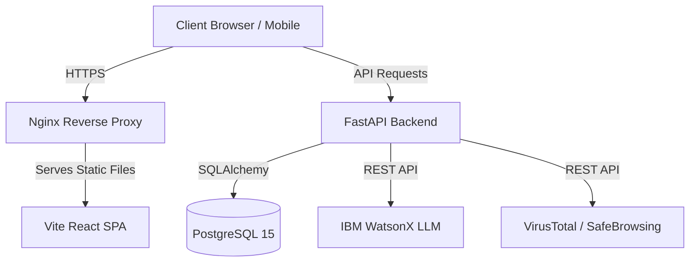

# ScamShield AI

**Role:** Full Stack Developer & Architect  
**Timeline:** [Insert Date]  
**Links:** [GitHub Repository](#) | [Live Demo](#) | [Demo Video](#)

---

## 📖 Project Overview

**ScamShield AI** is a production-ready cybersecurity SaaS platform designed to detect, analyze, and neutralize digital threats in real-time. Built with a robust microservices architecture, it empowers users to scan websites, QR codes, and UPI addresses for malicious intent using an advanced ensemble of AI models and Threat Intelligence feeds.

## 🎯 The Problem

With the exponential rise in phishing attacks, malicious QR codes (Quishing), and fraudulent UPI handles, individuals and organizations lack a unified, accessible tool to verify digital endpoints before interacting with them. Existing solutions are either too fragmented, overly technical, or entirely reactive.

## 💡 The Solution

ScamShield acts as a proactive defense layer. By integrating IBM WatsonX LLMs for deep semantic analysis and leveraging industry-standard threat databases (VirusTotal, Google Safe Browsing), ScamShield provides instant, actionable risk scores and automated PDF reports.

---

## 🛠️ Tech Stack

**Frontend**
- **Framework:** React 18 + Vite (TypeScript)
- **Styling:** Vanilla CSS (Glassmorphism, Dark Mode)
- **State Management:** React Context API
- **Routing:** React Router DOM

**Backend**
- **Framework:** FastAPI (Python 3.11)
- **Database:** PostgreSQL 15
- **ORM:** SQLAlchemy 2.0 + Alembic (Migrations)
- **Authentication:** JWT (JSON Web Tokens) with Argon2 hashing
- **AI Integration:** IBM WatsonX (Direct API)

**DevOps & Infrastructure**
- **Containerization:** Docker & Docker Compose
- **CI/CD:** GitHub Actions (CodeQL, Linting, Docker Push)
- **Hosting:** Render / Railway

---

## 🚀 Core Features

- **Multi-Vector Scanning:** Analyze URLs, QR codes, and UPI handles in a single unified dashboard.
- **AI-Powered Risk Engine:** Utilizes IBM WatsonX to analyze linguistic patterns in website content for social engineering tactics.
- **Threat Intelligence Aggregation:** Correlates endpoints against VirusTotal, Google Safe Browsing, and PhishTank.
- **Automated Reporting:** Generates downloadable, white-labeled PDF forensic reports using ReportLab.
- **Secure Authentication:** Implements JWT-based auth with strict password hashing and rate limiting.
- **Responsive Dashboard:** A stunning, animated, glassmorphism UI optimized for desktop and mobile.

---

## 🏗️ System Architecture

---

## 🔒 Security Implementations

Security is a first-class citizen in ScamShield:
- **Rate Limiting:** `slowapi` prevents brute-force and DDoS attacks on auth and scanning endpoints.
- **Headers:** Strict Content-Security-Policy (CSP), X-Frame-Options, and X-Content-Type-Options applied via custom middleware.
- **Data Persistence:** Parameterized queries via SQLAlchemy prevent SQL Injection.
- **Secret Management:** Secrets injected strictly via Docker environment variables; zero hardcoded keys.

---

## 📸 Screenshots

*(Replace with actual screenshots of your application)*

- `[Screenshot 1: Landing Page / Login]`
- `[Screenshot 2: Main Threat Dashboard]`
- `[Screenshot 3: Website Scanner in Action]`
- `[Screenshot 4: PDF Report Preview]`
